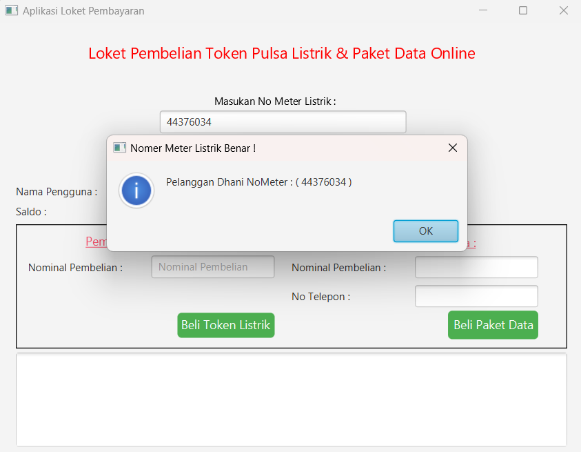
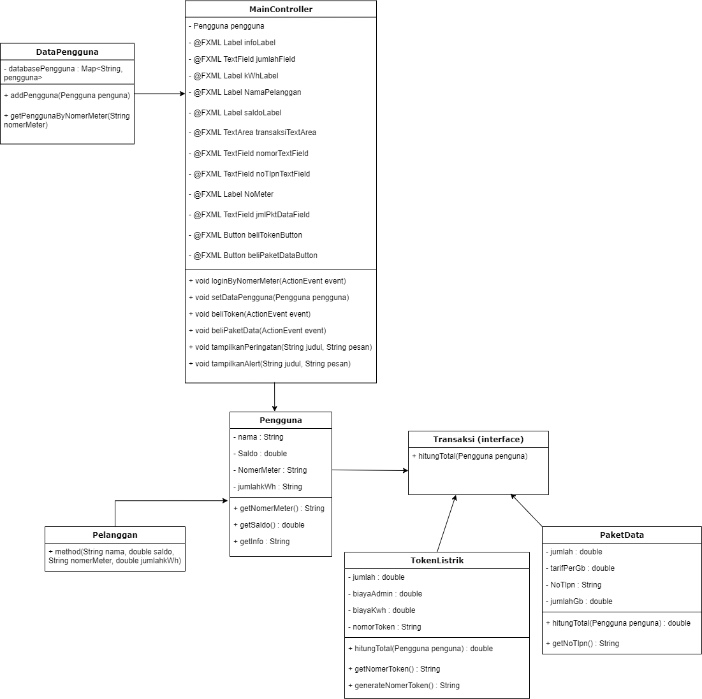
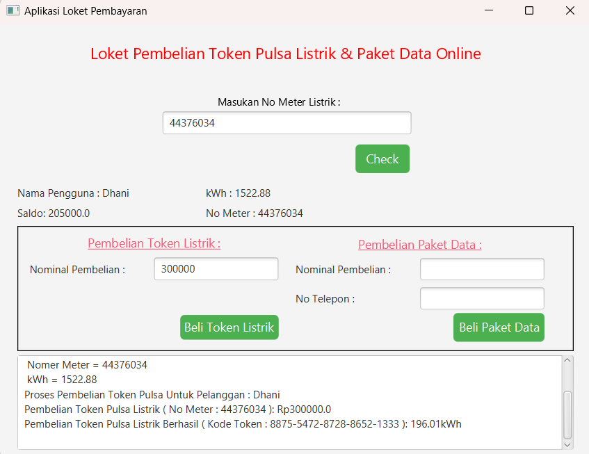
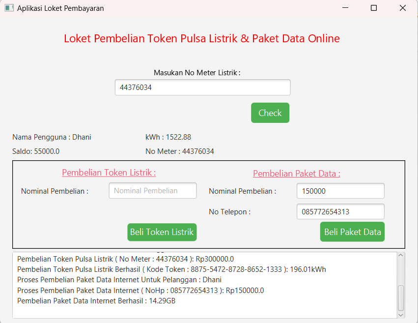

# UAS_PBO_LOKETPEMBELIANLISTRIK_45222210009_RAMADHANI_PRASETYO

Deskripsi singkat project UAS Pemograman Berbasis Object ini.

## Daftar Isi
- [Deskripsi Project](#deskripsi-proyek)
- [Fitur](#fitur)
- [Library yang di pakai](#library)
- [Diagram Class](#diagram-class)
- [ScreenShoots Program ](#ScreenShoots-Program)

## Deskripsi Project

Pembelian Token Listrik dan Paket Data Internet.Online, Karena kurang efisiensi dalam penghemat waktu dan biaya. perlu menghabiskan waktu untuk antri atau bepergian ke tempat penjualan loket listrik fisik. Dengan adanya program pembelian Token Listrik memberikan kemudahan dalam membeli Token Listrik dan Paket Data dan dapat menghindari kehabisan listrik atau kuota secara tiba-tiba.
## Fitur
- Mencari Nomer Meter Listrik Pelanggan
- Pembelian Token Listrik
- Pembelian Paket Data Internet

## library

- javafx.fxml.FXML (untuk mendefinisikan antarmuka pengguna dalam JavaFX)
- javafx.event.ActionEvent (untuk aksi dalam JavaFX sepeti "beliToken", "beliPaketData")
- javafx.scene.control.* ( untuk berbagai kontrol antarmuka pengguna seperti tombol, kotak teks, tabel, dll.)
- javafx.scene.control.Alert (untuk menampilkan kotak dialog pemberitahuan kepada pengguna, seperti pesan konfirmasi atau informasi.)
- java.text.DecimalFormat (untuk memformat dan mengurai angka desimal)
- java.util.Random (untuk menghasilkan angka acak)
- java.util.HashMap (implementasi dari antarmuka Map dalam Java)
- java.util.Map (untuk mengelola dan mengakses data)

## Diagram Class

## ScreenShoots Program 

